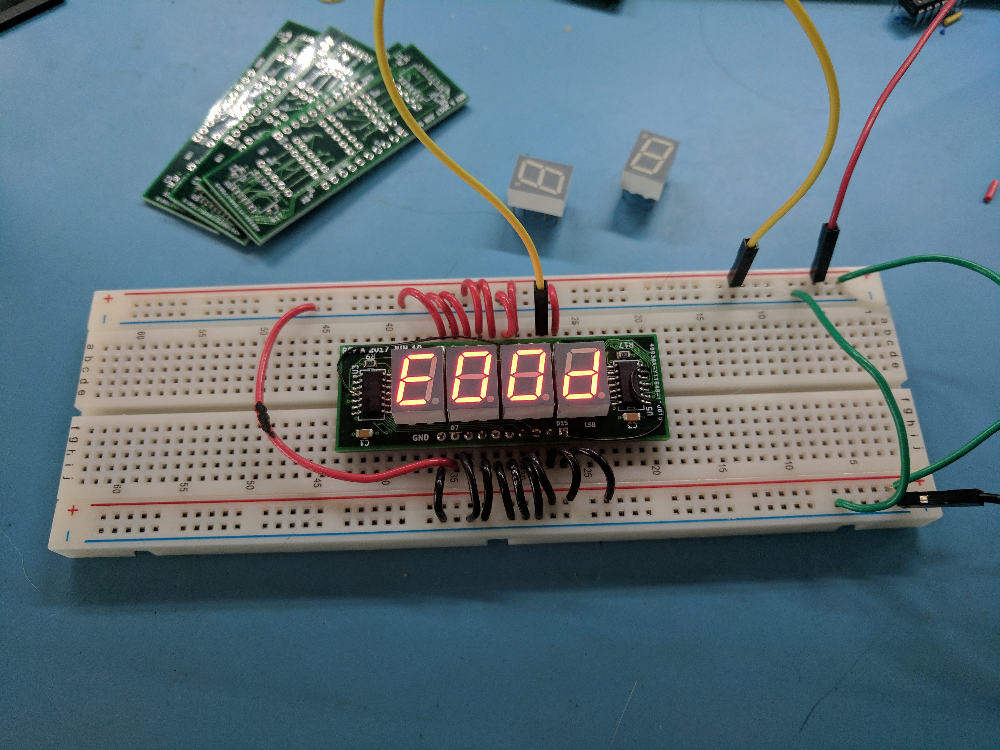

# 4_digit_hex_display
A 4-digit hex display.

* Runs off 5V.
* Uses Vishay TDSR1060 7-segment displays (the dots are not used).
* Uses ATTINY84A as a 16x7 ROM (requires a programmer).
* See bin2hex.S for pinouts, instructions.

